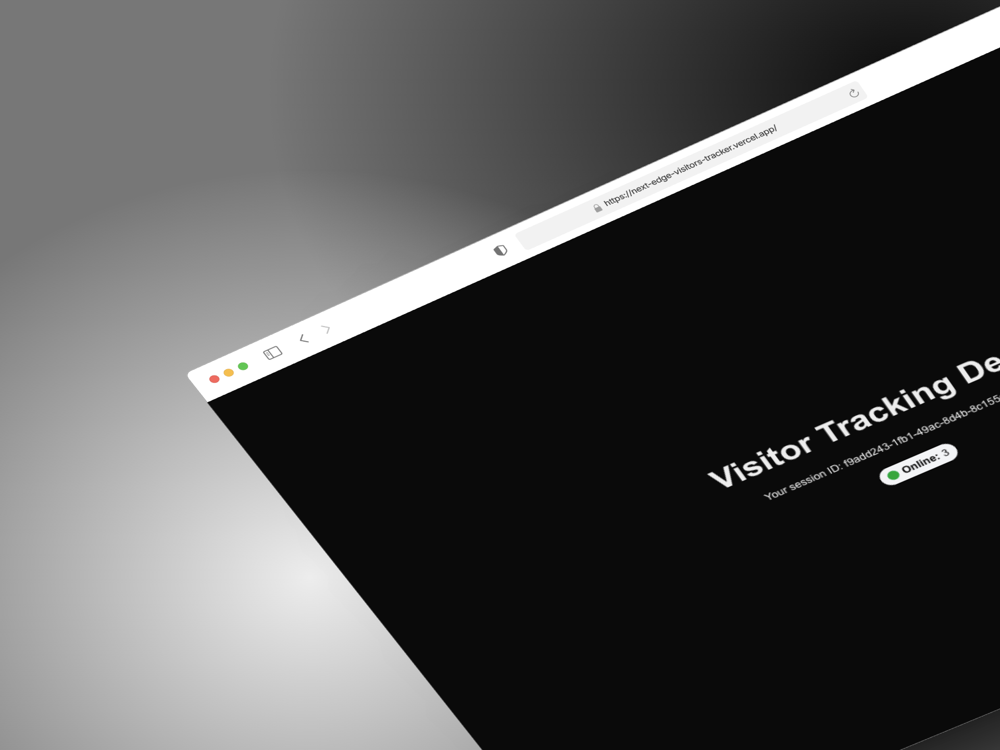

# Next Edge Visitors Tracking Tool

[Repo](https://github.com/manuelsanchez2/next-edge-visitors-tracker)
|
[Live](https://next-edge-visitors-tracker.vercel.app/)

Add a visitors tracking on your pages by using the power of the Edge!

## Requirements

- Node.js
- nvm (we are using lts/\*)
- npm

## Setup

You will need to copy the content of the `.env.example` in a new `.env` file.

- Open [Neon](https://console.neon.tech/app/projects) and create a project to have the `DATABASE_UR`L.
- Open [Upstash](https://upstash.com/) and create a free project to have the `UPSTASH_REDIS_REST_URL` and `UPSTASH_REDIS_REST_TOKEN`

You should be ready to go with this!

## How it works

You have basically three end poins in the `api` folder that are important:

- api/track - POST - adds the user to the table for the first time
- api/ping - POST - revalidates the user (is he/she still online or not)
- api/activeVisitors - GET - fetches the current number of online users

Since we need some ways to handle rate limit and the edge is edgy, Upstash can cover us here!

## Future ToDos

- [ ] I stored also in the table the target domain of the user. This way, theoretically we can use the same tables for different projects and generate a dashboard where you can see your online users in all your projects at the same time.
- [ ] A cron job would be cool to delete old entries (after 2-3 hours). I do not want to pay Vercel for this, so let's see if we can find some alternative.
